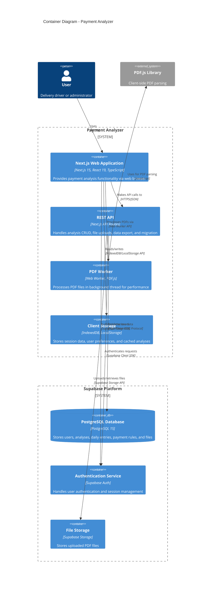
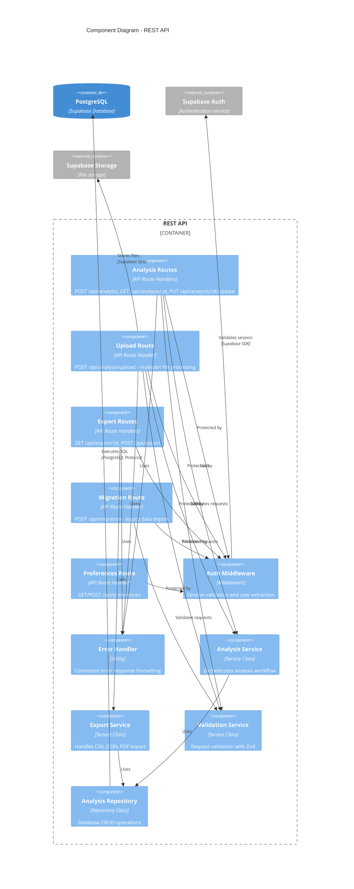
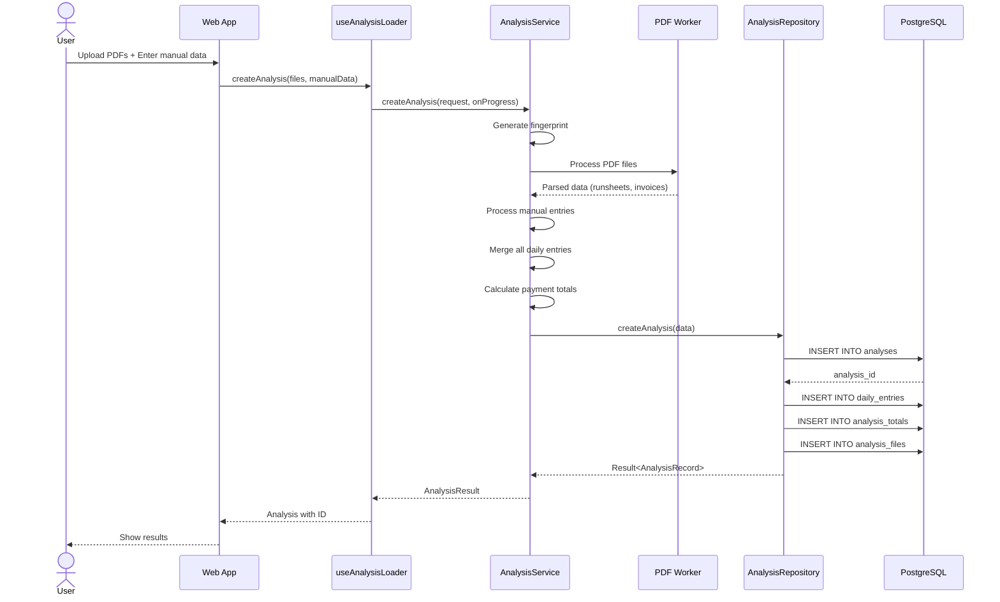
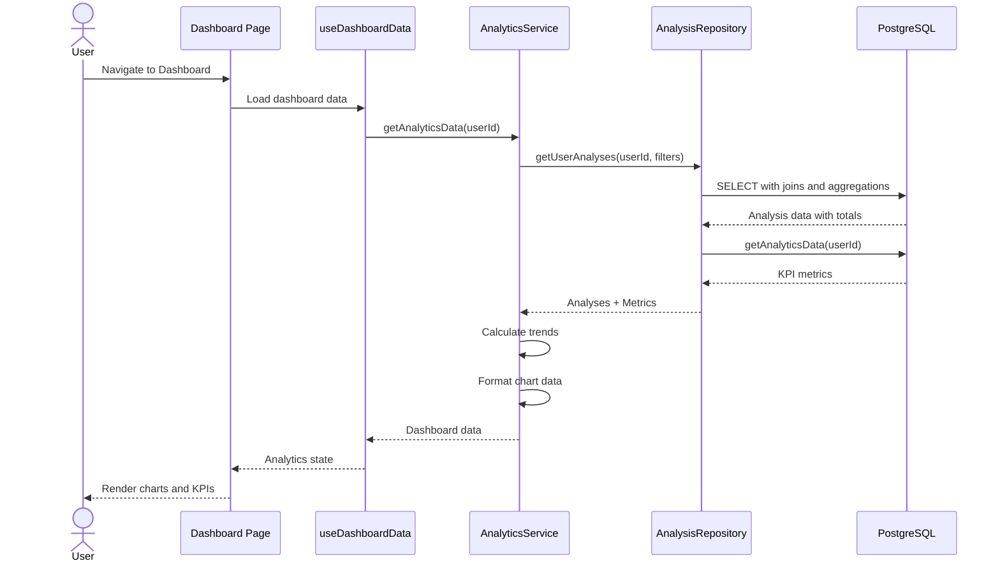
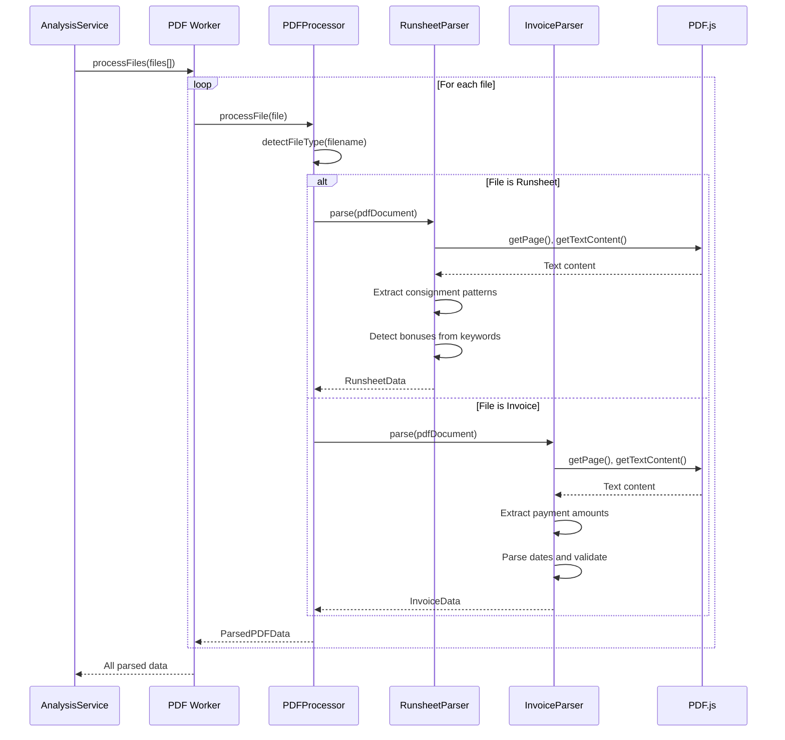
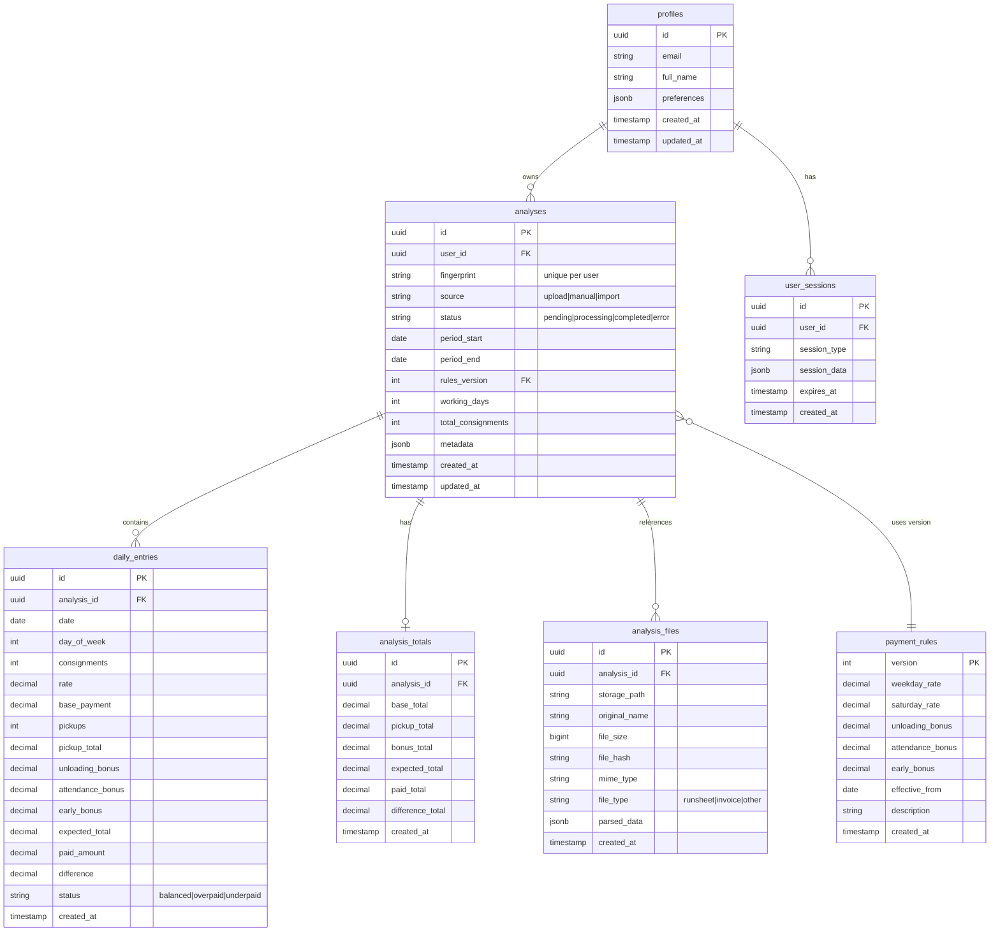
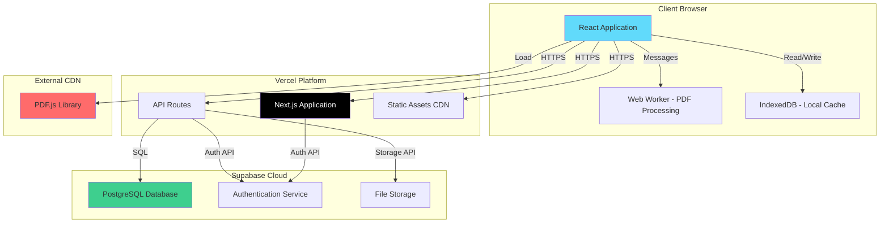
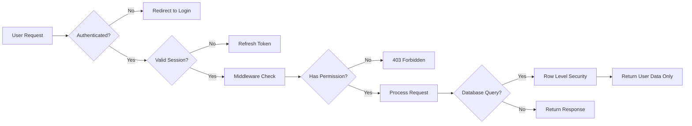

# C4 Architecture Model - Payment Analyzer

This document provides a comprehensive C4 model of the Payment Analyzer system, following the C4 model methodology (Context, Containers, Components, and Code).

## Level 1: System Context Diagram

The system context diagram shows how the Payment Analyzer fits into the wider system landscape and who uses it.

```mermaid
C4Context
    title System Context Diagram - Payment Analyzer

    Person(driver, "Delivery Driver", "A delivery driver who needs to analyze and verify payment settlements")
    Person(admin, "Administrator", "System administrator managing user accounts and system configuration")

    System(paymentAnalyzer, "Payment Analyzer", "Analyzes delivery payment data from runsheets and invoices, calculates expected payments, and identifies discrepancies")

    System_Ext(supabase, "Supabase", "Authentication, database, and storage services")
    System_Ext(pdfjs, "PDF.js CDN", "Client-side PDF parsing library")```mermaid
C4Context
    title System Context Diagram - Payment Analyzer

    Person(driver, "Delivery Driver", "A delivery driver who needs to analyze and verify payment settlements")
    Person(admin, "Administrator", "System administrator managing user accounts and system configuration")

    System(paymentAnalyzer, "Payment Analyzer", "Analyzes delivery payment data from runsheets and invoices, calculates expected payments, and identifies discrepancies")

    System_Ext(supabase, "Supabase", "Authentication, database, and storage services")
    System_Ext(pdfjs, "PDF.js CDN", "Client-side PDF parsing library")
    System_Ext(browser, "Web Browser", "User's web browser for file access")

    Rel(driver, paymentAnalyzer, "Uploads PDFs, enters manual data, views payment analysis", "HTTPS")
    Rel(admin, paymentAnalyzer, "Manages users and system configuration", "HTTPS")

    Rel(paymentAnalyzer, supabase, "Authenticates users, stores analysis data", "HTTPS/PostgreSQL")
    Rel(paymentAnalyzer, pdfjs, "Loads PDF parsing library", "HTTPS")
    Rel(paymentAnalyzer, browser, "Accesses local files via File API", "JavaScript API")

    UpdateLayoutConfig($c4ShapeInRow="3", $c4BoundaryInRow="1")
```
    System_Ext(browser, "Web Browser", "User's web browser for file access")

    Rel(driver, paymentAnalyzer, "Uploads PDFs, enters manual data, views payment analysis", "HTTPS")
    Rel(admin, paymentAnalyzer, "Manages users and system configuration", "HTTPS")

    Rel(paymentAnalyzer, supabase, "Authenticates users, stores analysis data", "HTTPS/PostgreSQL")
    Rel(paymentAnalyzer, pdfjs, "Loads PDF parsing library", "HTTPS")
    Rel(paymentAnalyzer, browser, "Accesses local files via File API", "JavaScript API")

    UpdateLayoutConfig($c4ShapeInRow="3", $c4BoundaryInRow="1")
```

### Key Relationships

| From | To | Purpose | Protocol |
|------|-----|---------|----------|
| Delivery Driver | Payment Analyzer | Analyze payment data | HTTPS |
| Administrator | Payment Analyzer | System management | HTTPS |
| Payment Analyzer | Supabase | Data persistence & auth | HTTPS/PostgreSQL |
| Payment Analyzer | PDF.js CDN | PDF parsing capability | HTTPS |
| Payment Analyzer | Browser | Local file access | JavaScript File API |

---

## Level 2: Container Diagram

The container diagram shows the high-level technical building blocks of the Payment Analyzer system.



### Container Descriptions

#### Web Application (Next.js)
- **Technology**: Next.js 15, React 19, TypeScript, Tailwind CSS
- **Responsibilities**:
  - User interface rendering
  - Client-side routing
  - State management (React Query, Zustand)
  - Form handling and validation
  - Real-time progress tracking

#### REST API (Next.js API Routes)
- **Technology**: Next.js API Routes, TypeScript
- **Responsibilities**:
  - Analysis CRUD operations
  - File upload processing
  - Data export (CSV, JSON, PDF-ready)
  - Legacy data migration
  - Authentication middleware

#### PDF Worker (Web Worker)
- **Technology**: Web Worker API, PDF.js 3.11
- **Responsibilities**:
  - Background PDF processing
  - Runsheet data extraction
  - Invoice data extraction
  - Prevents UI blocking

#### Client Storage (Browser APIs)
- **Technology**: IndexedDB, LocalStorage
- **Responsibilities**:
  - Session recovery
  - User preferences
  - Analysis caching
  - Offline capability

#### PostgreSQL Database (Supabase)
- **Technology**: PostgreSQL 15
- **Schema**:
  - profiles (user data)
  - analyses (analysis metadata)
  - daily_entries (daily payment records)
  - analysis_totals (aggregated calculations)
  - analysis_files (PDF references)
  - payment_rules (versioned calculation rules)
  - user_sessions (recovery data)

#### Authentication Service (Supabase Auth)
- **Technology**: Supabase Auth
- **Features**:
  - Email/password authentication
  - Session management
  - Row Level Security (RLS)
  - Password reset

#### File Storage (Supabase Storage)
- **Technology**: Supabase Storage
- **Usage**:
  - PDF file storage
  - Secure file access
  - File metadata tracking

---

## Level 3: Component Diagram

The component diagram shows the internal structure of the Next.js Web Application and API containers.

### Web Application Components

```mermaid
C4Component
    title Component Diagram - Next.js Web Application

    Container_Boundary(webApp, "Next.js Web Application") {
        Component(pages, "Pages", "Next.js App Router", "Dashboard, Analysis, History, Reports, Settings pages")
        Component(layouts, "Layouts", "React Components", "App layout, dashboard layout, authentication layout")

        Component(analysisComponents, "Analysis Components", "React Components", "File upload, manual entry, validation, results display")
        Component(dashboardComponents, "Dashboard Components", "React Components", "Executive summary, charts, calendar, quick actions")
        Component(reportComponents, "Report Components", "React Components", "Report viewer, filters, export controls")
        Component(uiComponents, "UI Components", "React Components", "Buttons, cards, inputs, modals, tooltips (Radix UI)")

        Component(hooks, "Custom Hooks", "React Hooks", "useAnalysisLoader, useDashboardData, useFileValidation, useSessionRecovery")
        Component(providers, "Context Providers", "React Context", "AuthProvider, ThemeProvider, ToastProvider")

        Component(domainServices, "Domain Services", "TypeScript Classes", "Payment calculation, validation, file fingerprinting")
        Component(infraServices, "Infrastructure Services", "TypeScript Classes", "PDF processing, Supabase clients, worker management")
        Component(appServices, "Application Services", "TypeScript Classes", "Analysis service, auth service, analytics service, export service")

        Component(repositories, "Repositories", "TypeScript Classes", "AnalysisRepository - database access layer")
        Component(entities, "Domain Entities", "TypeScript Classes", "Analysis, DailyEntry, PaymentRules, Money, DateRange")
    }

    ComponentDb(clientCache, "Client Cache", "IndexedDB", "Session and preference storage")
    Container_Ext(api, "REST API", "Next.js API Routes")
    Container_Ext(pdfWorker, "PDF Worker", "Web Worker")

    Rel(pages, layouts, "Uses")
    Rel(pages, analysisComponents, "Renders")
    Rel(pages, dashboardComponents, "Renders")
    Rel(pages, reportComponents, "Renders")

    Rel(analysisComponents, uiComponents, "Composed from")
    Rel(dashboardComponents, uiComponents, "Composed from")
    Rel(reportComponents, uiComponents, "Composed from")

    Rel(analysisComponents, hooks, "Uses")
    Rel(dashboardComponents, hooks, "Uses")
    Rel(pages, hooks, "Uses")

    Rel(hooks, appServices, "Calls")
    Rel(appServices, domainServices, "Uses")
    Rel(appServices, infraServices, "Uses")
    Rel(appServices, repositories, "Uses")

    Rel(domainServices, entities, "Works with")
    Rel(repositories, entities, "Maps to/from")

    Rel(appServices, api, "HTTP requests", "JSON")
    Rel(infraServices, pdfWorker, "Processes PDFs via", "Web Worker API")
    Rel(appServices, clientCache, "Reads/writes", "IndexedDB")

    Rel(providers, pages, "Wraps")

    UpdateLayoutConfig($c4ShapeInRow="3", $c4BoundaryInRow="1")
```



### API Components



### Component Descriptions

#### Domain Layer Components

**Domain Entities**
- `Analysis`: Aggregate root representing a complete payment analysis
- `DailyEntry`: Individual day payment record with bonuses
- `PaymentRules`: Versioned payment calculation rules
- `Money`: Value object for currency handling
- `DateRange`: Value object for date period management
- `ConsignmentCount`: Value object for consignment counting

**Domain Services**
- `PaymentCalculatorService`: Core business logic for payment calculations
- `ValidationService`: Business rule validation
- `FileFingerprintService`: Duplicate detection via file hashing

#### Infrastructure Layer Components

**PDF Processing**
- `PDFProcessor`: Orchestrates PDF processing workflow
- `RunsheetParser`: Extracts consignment data from runsheets
- `InvoiceParser`: Extracts payment amounts from invoices
- `PDFParserBase`: Base class with common PDF functionality
- `PDFWorkerClient`: Interface to Web Worker

**Database**
- `AnalysisRepository`: Single repository for all database operations
- Uses Result pattern for error handling
- Implements optimistic locking and deduplication

**Supabase Clients**
- `createClient()`: Client-side Supabase client
- `createServerClient()`: Server-side Supabase client with cookies
- `createSimpleClient()`: Lightweight client for specific operations

#### Application Layer Components

**Services**
- `AnalysisService`: Orchestrates analysis creation and processing
- `AuthService`: User authentication and session management
- `AnalyticsService`: Dashboard KPI calculations
- `ExportService`: Multi-format data export
- `SessionRecoveryService`: Analysis session recovery
- `PreferencesService`: User preferences management
- `FileUpdateDetectionService`: Detects file changes

**Custom Hooks**
- `useAnalysisLoader`: Loads and manages analysis state
- `useDashboardData`: Fetches dashboard analytics
- `useFileValidationAndHashing`: Validates and hashes files
- `useSessionRecovery`: Recovers interrupted sessions
- `useCalendarData`: Calendar widget data
- `useReportData`: Report filtering and loading

#### UI Components

**Feature Components**
- Analysis: Step1Container, Step2Container, Step3Container, FileUpload, ValidationDisplay
- Dashboard: ExecutiveSummary, WeeklyRevenueChart, CalendarWidget, QuickActions
- Reports: ReportViewer, ReportFilters, ReportExport

**Shared UI Components** (Radix UI based)
- Button, Card, Input, Select, Dialog, Popover, RadioGroup
- Toast notifications, Tooltips, Progress bars, Badges

---

## Level 4: Code Diagram - Critical Domain Classes

```mermaid
classDiagram
    class Analysis {
        -string _id
        -string _userId
        -string _fingerprint
        -AnalysisSource _source
        -AnalysisStatus _status
        -DateRange _period
        -number _rulesVersion
        -DailyEntry[] _dailyEntries
        -AnalysisMetadata _metadata
        -Date _createdAt
        -Date _updatedAt

        +id: string
        +userId: string
        +status: AnalysisStatus
        +workingDaysCount: number
        +totalConsignments: ConsignmentCount
        +baseTotal: Money
        +bonusTotal: Money
        +expectedTotal: Money
        +paidTotal: Money
        +differenceTotal: Money
        +overallStatus: PaymentStatus

        +addDailyEntry(entry: DailyEntry): void
        +removeDailyEntry(date: Date): void
        +getDailyEntry(date: Date): DailyEntry
        +updateStatus(status: AnalysisStatus): void
        +updateMetadata(metadata: AnalysisMetadata): void
        +isComplete(): boolean
        +toJSON(): object
        +fromJSON(data: object): Analysis
    }

    class DailyEntry {
        -Date _date
        -number _dayOfWeek
        -ConsignmentCount _consignments
        -Money _rate
        -Money _paidAmount
        -boolean _hasUnloadingBonus
        -boolean _hasAttendanceBonus
        -boolean _hasEarlyBonus
        -number _pickups

        +date: Date
        +consignments: ConsignmentCount
        +basePayment: Money
        +totalBonus: Money
        +pickupTotal: Money
        +expectedTotal: Money
        +difference: Money
        +status: PaymentStatus
        +isWorkingDay: boolean
        +isSaturday: boolean

        +toJSON(): object
        +fromJSON(data: object): DailyEntry
    }

    class PaymentRules {
        -number _version
        -Money _weekdayRate
        -Money _saturdayRate
        -Money _unloadingBonus
        -Money _attendanceBonus
        -Money _earlyBonus
        -Date _effectiveFrom

        +calculateBasePayment(consignments: ConsignmentCount, isSaturday: boolean): Money
        +calculateBonuses(date: Date, flags: BonusFlags): Money
        +getTotalRate(isSaturday: boolean): Money
        +isEffective(date: Date): boolean
    }

    class Money {
        -number _amount
        -string _currency

        +amount: number
        +currency: string

        +add(other: Money): Money
        +subtract(other: Money): Money
        +multiply(factor: number): Money
        +isZero(): boolean
        +isPositive(): boolean
        +isNegative(): boolean
        +equals(other: Money): boolean
        +static zero(): Money
    }

    class DateRange {
        -Date _start
        -Date _end

        +start: Date
        +end: Date
        +durationInDays: number

        +contains(date: Date): boolean
        +overlaps(other: DateRange): boolean
        +formatRange(): string
        +getDatesInRange(): Date[]
    }

    class ConsignmentCount {
        -number _count

        +count: number

        +add(other: ConsignmentCount): ConsignmentCount
        +subtract(other: ConsignmentCount): ConsignmentCount
        +multiply(factor: number): ConsignmentCount
        +isZero(): boolean
        +static zero(): ConsignmentCount
    }

    class AnalysisRepository {
        -SupabaseClient supabase

        +createAnalysis(data: CreateAnalysisData): Result~AnalysisRecord~
        +updateAnalysisStatus(analysisId: string, status: AnalysisStatus): Result~void~
        +createDailyEntries(analysisId: string, entries: CreateDailyEntryData[]): Result~void~
        +createAnalysisTotals(analysisId: string, totals: CreateAnalysisTotalData): Promise
        +createAnalysisFiles(analysisId: string, files: CreateAnalysisFileData[]): Promise
        +getAnalysisById(analysisId: string): Promise
        +getUserAnalyses(userId: string, options: QueryOptions): Promise
        +deleteAnalysis(analysisId: string): Promise
        +getAnalyticsData(userId: string): Promise
        +findAnalysisByFingerprint(userId: string, fingerprint: string): Result~AnalysisRecord~
        +updateDailyEntry(userId: string, analysisId: string, entryDate: string, updateData: Partial): Result~void~
        -handleDatabaseError(error: SupabaseError, operation: string): Result~never~
    }

    class AnalysisService {
        -FileFingerprintService fingerprintService

        +createAnalysis(request: CreateAnalysisRequest, onProgress: ProgressCallback): Promise~AnalysisResult~
        +getAnalysis(userId: string, analysisId: string): Promise~Analysis~
        +updateAnalysis(userId: string, analysisId: string, updates: AnalysisUpdates): Promise~void~
        +deleteAnalysis(userId: string, analysisId: string): Promise~void~
        +exportAnalysis(analysisId: string, format: ExportFormat): Promise~ExportData~
        -processPDFFiles(files: AnalysisFile[], onProgress: ProgressCallback): Promise~ParsedData~
        -processManualEntries(entries: ManualEntry[]): DailyEntry[]
        -calculateTotals(dailyEntries: DailyEntry[]): AnalysisTotals
        -saveAnalysis(analysis: Analysis): Promise~string~
    }

    class PDFProcessor {
        -RunsheetParser runsheetParser
        -InvoiceParser invoiceParser

        +processFile(file: File): Promise~ParsedPDFData~
        +detectFileType(filename: string, content: string): FileType
        -extractRunsheetData(pdf: PDFDocument): Promise~RunsheetData~
        -extractInvoiceData(pdf: PDFDocument): Promise~InvoiceData~
    }

    Analysis "1" *-- "0..*" DailyEntry : contains
    Analysis "1" --> "1" DateRange : has period
    Analysis "1" --> "1" PaymentRules : uses
    DailyEntry "1" --> "1" Money : has rate
    DailyEntry "1" --> "1" Money : has paidAmount
    DailyEntry "1" --> "1" ConsignmentCount : has
    PaymentRules "1" --> "5" Money : has rates and bonuses
    AnalysisService "1" --> "1" AnalysisRepository : uses
    AnalysisService "1" --> "1" PDFProcessor : uses
    AnalysisService --> Analysis : creates/manages
    AnalysisRepository --> Analysis : persists/retrieves
```



### Key Design Patterns

#### Domain-Driven Design (DDD)
- **Entities**: Analysis, DailyEntry with identity
- **Value Objects**: Money, DateRange, ConsignmentCount (immutable)
- **Aggregates**: Analysis as aggregate root
- **Repositories**: AnalysisRepository for persistence
- **Domain Services**: Payment calculation, validation

#### Application Patterns
- **Repository Pattern**: Clean separation of data access
- **Service Layer**: AnalysisService orchestrates workflows
- **Result Pattern**: Type-safe error handling
- **Strategy Pattern**: Different PDF parsers for runsheets and invoices

#### React Patterns
- **Custom Hooks**: Encapsulate stateful logic
- **Context Providers**: Global state management
- **Container/Presenter**: Separation of logic and presentation
- **Composition**: UI components built from smaller primitives

---

## Data Flow Diagrams

### Analysis Creation Flow



### Dashboard Analytics Flow



### PDF Processing Flow



---

## Database Schema

### Entity Relationship Diagram



### Key Indexes

```sql
-- Optimized for user's analysis listing
CREATE INDEX idx_analyses_user_status_created
ON analyses(user_id, status, created_at DESC);

-- Fingerprint duplicate detection
CREATE INDEX idx_analyses_fingerprint
ON analyses(user_id, fingerprint) WHERE fingerprint IS NOT NULL;

-- Daily entries lookup
CREATE INDEX idx_daily_entries_analysis
ON daily_entries(analysis_id, date);

-- Analytics queries
CREATE INDEX idx_analyses_period
ON analyses(user_id, period_start, period_end);
```

---

## Technology Stack Summary

### Frontend
| Technology | Version | Purpose |
|------------|---------|---------|
| Next.js | 15.5.0 | React framework with SSR and App Router |
| React | 19.1.0 | UI library |
| TypeScript | 5.9.2 | Type safety |
| Tailwind CSS | 4.x | Styling |
| Radix UI | Latest | Accessible UI primitives |
| React Query | 5.85.0 | Server state management |
| Zustand | 5.0.0 | Client state management |
| Recharts | 3.1.0 | Data visualization |
| Framer Motion | 12.23.12 | Animations |
| PDF.js | 5.4.54 + CDN 3.11.174 | PDF processing |
| React Hook Form | 7.62.0 | Form handling |
| Zod | 3.23.8 | Schema validation |
| date-fns | 4.1.0 | Date utilities |

### Backend
| Technology | Version | Purpose |
|------------|---------|---------|
| Next.js API Routes | 15.5.0 | REST API endpoints |
| Supabase | 2.56.0 | Backend services |
| PostgreSQL | 15 | Primary database |
| IndexedDB | - | Client-side storage |

### Development
| Technology | Version | Purpose |
|------------|---------|---------|
| Vitest | 3.2.0 | Unit testing |
| Testing Library | 16.0.0 | Component testing |
| Playwright | 1.55.0 | E2E testing |
| ESLint | 9.34.0 | Linting |
| pnpm | - | Package manager |

---

## Deployment Architecture



### Deployment Characteristics

**Next.js Application (Vercel)**
- **Hosting**: Vercel Edge Network
- **Build**: Static generation for public pages, SSR for authenticated routes
- **API Routes**: Serverless functions with regional deployment
- **CDN**: Global edge caching for static assets

**Supabase Platform**
- **Database**: PostgreSQL with connection pooling
- **Authentication**: Distributed auth service with JWT
- **Storage**: Distributed file storage with CDN
- **Row Level Security**: Database-level authorization

**Client-Side**
- **PDF Processing**: In-browser via Web Workers (no server processing)
- **Offline Capability**: IndexedDB caching for analysis recovery
- **Progressive Enhancement**: Works without JavaScript for basic functionality

---

## Security Architecture

### Authentication & Authorization



### Security Layers

1. **Application Layer**
   - Next.js middleware for route protection
   - API authentication middleware
   - CSRF protection
   - Input validation with Zod schemas

2. **Database Layer**
   - Row Level Security (RLS) policies
   - User data isolation
   - Prepared statements (SQL injection prevention)

3. **Client Layer**
   - Content Security Policy (CSP)
   - XSS protection via React
   - Secure cookie handling
   - File validation before processing

4. **Network Layer**
   - HTTPS only
   - CORS configuration
   - Rate limiting (Vercel)
   - DDoS protection (Vercel Edge)

---

## Performance Optimizations

### Frontend Optimizations
- **Code Splitting**: Route-based and component-based splitting
- **Web Workers**: PDF processing doesn't block UI
- **React Query**: Automatic caching and background refetching
- **Memoization**: React.memo, useMemo, useCallback for expensive operations
- **Virtual Scrolling**: For large analysis lists
- **Debouncing**: Search and filter inputs
- **Progressive Loading**: Load critical content first

### Backend Optimizations
- **Database Indexes**: Optimized for common query patterns
- **Connection Pooling**: Supabase connection management
- **Batch Operations**: Bulk inserts for daily entries
- **Query Optimization**: Single query with joins instead of N+1
- **Result Pattern**: Avoid throwing errors in hot paths

### API Optimizations
- **Edge Functions**: Serverless with regional deployment
- **Response Compression**: Gzip/Brotli
- **Pagination**: Cursor-based for large datasets
- **Selective Queries**: Only fetch needed fields
- **Caching Headers**: Browser and CDN caching

---

## Observability & Monitoring

### Logging Strategy
- **Client Errors**: ErrorBoundary component catches React errors
- **API Errors**: Centralized error handler with structured logging
- **Database Errors**: Repository layer logs with error codes
- **Performance**: Query performance monitor tracks slow queries

### Metrics Tracked
- **User Metrics**: Daily active users, analyses created
- **Performance Metrics**: Page load time, API response time, PDF processing time
- **Business Metrics**: Total analyses, average payments, error rates
- **Database Metrics**: Query latency, connection pool usage

### Error Handling
- **Result Pattern**: Type-safe error handling in domain layer
- **AppError Class**: Custom error types with codes and context
- **User Feedback**: Toast notifications for user-facing errors
- **Retry Logic**: Automatic retry for transient failures

---

## Future Architecture Considerations

### Scalability
- **Horizontal Scaling**: Serverless architecture supports automatic scaling
- **Database Sharding**: User-based sharding if needed
- **CDN Expansion**: Additional edge locations for global users
- **Worker Pools**: Distributed PDF processing for high volume

### Extensibility
- **Plugin System**: Custom payment rules and calculators
- **Webhook Support**: Event notifications for integrations
- **API Versioning**: Support multiple API versions
- **Multi-tenancy**: Organization-level isolation

### Advanced Features
- **Machine Learning**: Anomaly detection in payment patterns
- **Real-time Collaboration**: Multiple users editing same analysis
- **Mobile Apps**: React Native using shared domain logic
- **Blockchain Audit Trail**: Immutable payment records

---

## Appendix: C4 Model Methodology

The C4 model is a hierarchical set of software architecture diagrams:

1. **Level 1 - Context**: Shows the system in its environment
2. **Level 2 - Container**: Shows the high-level technology choices
3. **Level 3 - Component**: Shows the internal structure of containers
4. **Level 4 - Code**: Shows the implementation details (optional)

**Benefits**:
- Different levels of abstraction for different audiences
- Easy to maintain and update
- Supports communication between technical and non-technical stakeholders
- Complements agile development practices

**Further Reading**:
- https://c4model.com/
- https://www.infoq.com/articles/C4-architecture-model/
