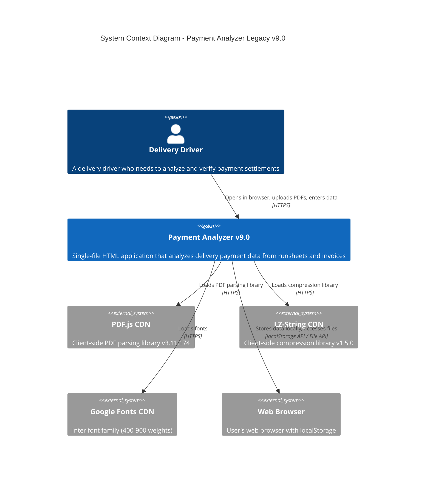
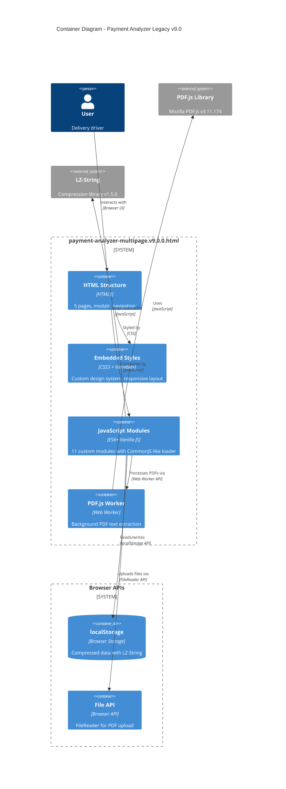
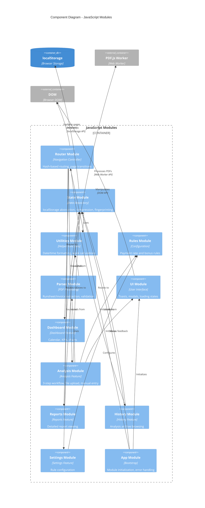
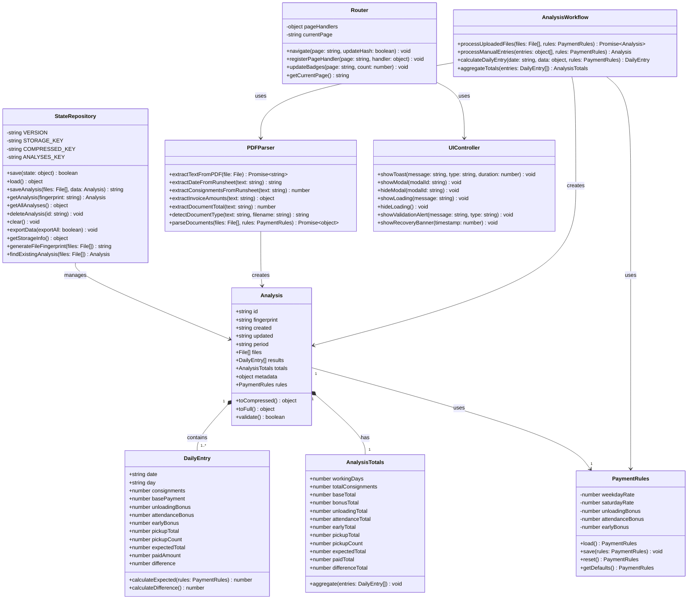
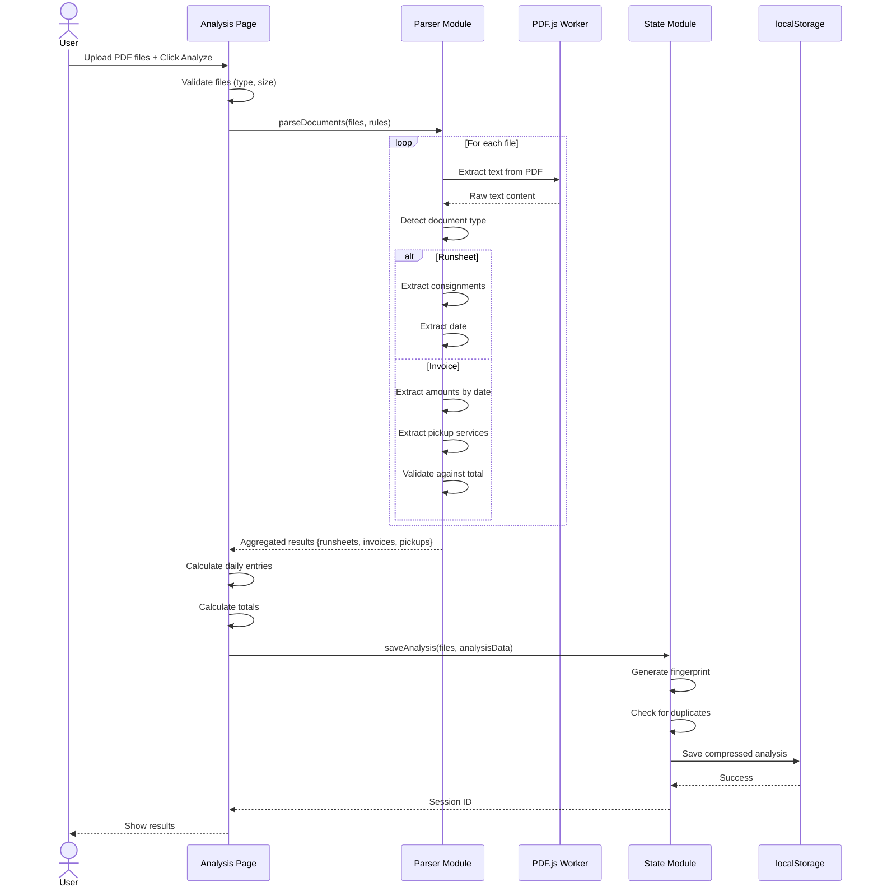
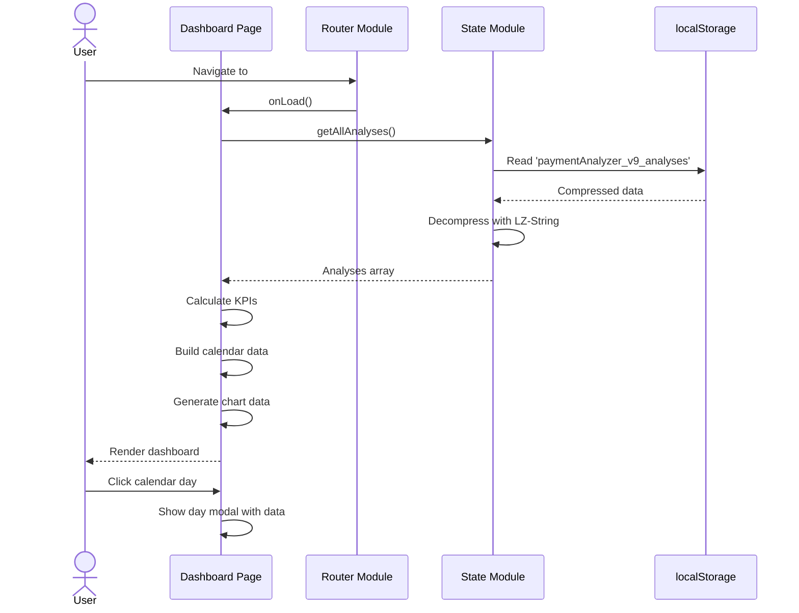
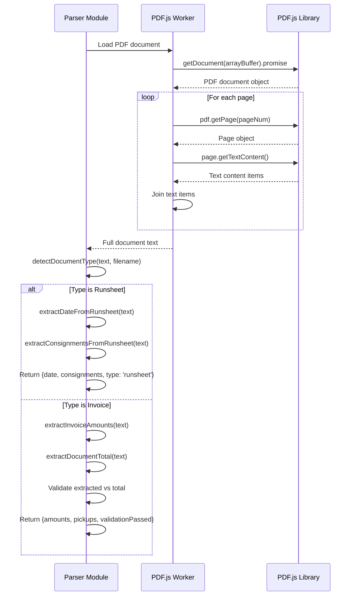
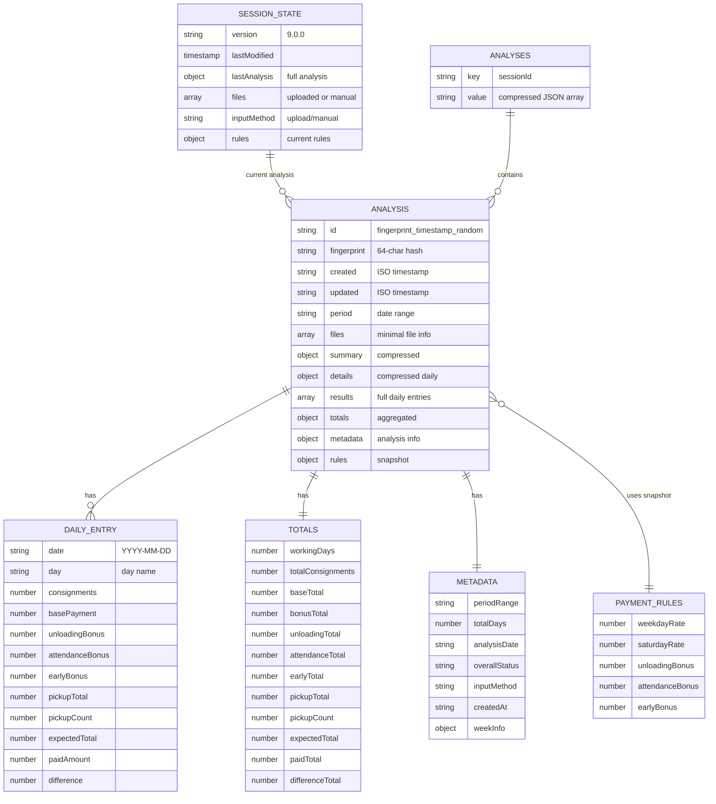
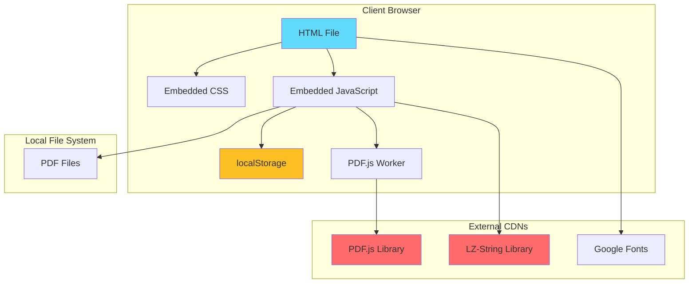
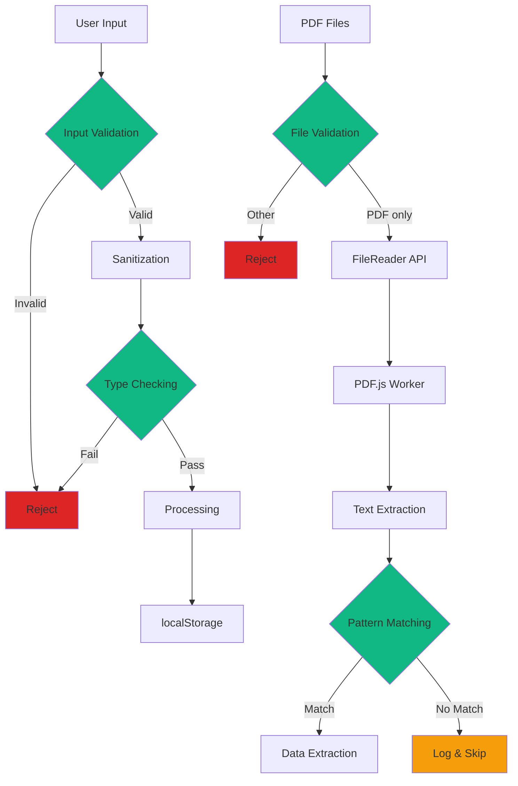

# C4 Architecture Model - Payment Analyzer Legacy (v9.0.0)

This document provides a comprehensive C4 model of the **original Payment Analyzer v9.0.0** (single-file HTML application), following the C4 model methodology (Context, Containers, Components, and Code).

---

## Level 1: System Context Diagram

The system context diagram shows how the legacy Payment Analyzer fits into the wider system landscape.



### Key Relationships

| From | To | Purpose | Protocol |
|------|-----|---------|----------|
| Delivery Driver | Payment Analyzer | Analyze payment data | Browser (file://) |
| Payment Analyzer | PDF.js CDN | PDF parsing capability | HTTPS |
| Payment Analyzer | LZ-String CDN | Data compression | HTTPS |
| Payment Analyzer | Google Fonts | Typography | HTTPS |
| Payment Analyzer | Browser localStorage | Data persistence | Browser API |

### Deployment Model
- **Type**: Static HTML file (486.6KB)
- **Hosting**: Can be hosted on any web server or opened locally
- **Zero server dependencies**: Fully client-side application

---

## Level 2: Container Diagram

The container diagram shows the high-level technical building blocks of the single-file application.



### Container Descriptions

#### HTML Structure (Lines 1-6975)
- **Technology**: HTML5 with semantic markup
- **Components**:
  - 5 page sections (dashboard, analysis, reports, history, settings)
  - Bottom navigation bar
  - Modal dialogs (manual entry, edit day)
  - Toast notification container
  - Loading overlay
- **Features**:
  - Mobile-first responsive design
  - iOS safe area support
  - Accessibility features (ARIA labels)

#### Embedded CSS (Lines 12-6975)
- **Technology**: CSS3 with CSS Variables
- **Design System**:
  - 9-shade slate color palette
  - Inter font family
  - Consistent spacing/border radius
  - Transitions and animations
- **Architecture**:
  - CSS variables for theming (Lines 16-39)
  - Mobile-first responsive (breakpoints: 480px, 640px, 768px)
  - Component-based styling (BEM-like)

#### JavaScript Modules (Lines 6977-14493)
- **Technology**: ES6+ Vanilla JavaScript
- **Module System**: Custom CommonJS-like loader
- **11 Modules**:
  1. routerModule - Hash-based routing
  2. stateModule - localStorage persistence
  3. utilitiesModule - Date/time helpers
  4. rulesModule - Payment calculation rules
  5. parserModule - PDF processing
  6. uiModule - UI interactions
  7. dashboardModule - Dashboard logic
  8. analysisModule - Analysis workflow
  9. reportsModule - Report generation
  10. historyModule - History management
  11. settingsModule - Settings UI
  12. appModule - Bootstrap/initialization

#### PDF.js Worker
- **Technology**: Web Worker (external CDN)
- **Version**: 3.11.174
- **Purpose**: Off-thread PDF parsing
- **Configuration**: Lines 6978

#### localStorage (Browser API)
- **Keys**:
  - `paymentAnalyzer_v9_compressed` - Compressed session
  - `paymentAnalyzer_v9_analyses` - Analysis history
  - `pa:rules:v9` - Payment rules
  - `manualEntries_v9` - Manual entries
  - `uploadedFiles_v9` - File metadata
- **Compression**: LZ-String UTF-16
- **Limit**: 5-10MB browser-dependent
- **Management**: Auto-pruning (50 analysis max)

---

## Level 3: Component Diagram

The component diagram shows the internal structure of the JavaScript Modules container.

### Module Architecture



### Module Descriptions

#### Infrastructure Modules

**Router Module** (Lines 6997-7113)
- Hash-based SPA routing (`#dashboard`, `#analysis`, etc.)
- Navigation badge system
- Page lifecycle hooks (onLoad)
- Browser history integration
- Active state management

**State Module** (Lines 7116-7597)
- localStorage wrapper with compression
- File fingerprinting (64-char hash)
- Analysis CRUD operations
- Session state management
- Data export (JSON)
- Storage quota management
- Version migration (v8→v9)

**Utilities Module** (Lines 7600-7754)
- Date formatting (DD/MM/YYYY, ISO)
- Week number calculation (ISO 8601)
- Time ago formatting
- Day of week detection
- Date range calculations

**Rules Module** (Lines 7757-7798)
- Payment rate configuration
- Bonus configuration
- Load/save rules to localStorage
- Reset to defaults
- Default values:
  - Weekday rate: £2.00
  - Saturday rate: £3.00
  - Unloading bonus: £30.00
  - Attendance bonus: £25.00
  - Early bonus: £50.00

#### Business Logic Modules

**Parser Module** (Lines 7801-8169)
- PDF.js integration
- Text extraction from PDFs
- Document type detection (runsheet/invoice)
- Runsheet consignment extraction
  - 7-digit ID pattern matching
  - "AH" prefix detection
  - Context validation (Delivery/Collection)
- Invoice amount extraction
  - Date/time pattern matching
  - Amount validation (£3-£500)
  - Pickup service detection
  - Extra drops processing
- Document total validation (±£0.01 tolerance)
- Multi-page invoice support

**UI Module** (Lines 8170-8861)
- Toast notification system
- Modal management (show/hide)
- Loading overlay control
- Form validation feedback
- Validation alerts
- Recovery banner
- Button loading states

#### Feature Modules

**Dashboard Module** (Lines 8862-10163)
- Executive summary cards (4 KPIs)
- Calendar widget
  - Month navigation
  - Day data indicators
  - Interactive tooltips
- Revenue chart rendering
- View toggle (monthly/weekly)
- Quick actions
- Data aggregation from history

**Analysis Module** (Lines 10164-13166)
- 3-step wizard (Upload → Validate → Analyze)
- Input method toggle (upload vs manual)
- File upload handling
  - Drag-and-drop
  - File type validation
  - File preview
- Manual entry form
  - Real-time calculation
  - Bonus auto-detection by day
  - Tooltip system
- PDF processing orchestration
- Results presentation
  - Daily breakdown table
  - Summary cards
  - Week grouping
- Data persistence

**Reports Module** (Lines 13167-13529)
- Report header with metadata
- KPI summary dashboard
- Daily breakdown table
- Week navigation
- Week grouping/filtering
- Print functionality
- Pull-to-refresh indicator
- Empty state handling

**History Module** (Lines 13530-13806)
- Week-based history list
- Analysis metadata display
- Click-to-load previous analyses
- Clear history functionality
- Empty state handling

**Settings Module** (Lines 13807-13993)
- Payment rules form
- Currency input fields (£ prefix)
- Real-time validation
- Save/reset actions
- Clear all data functionality
- Storage info display

**App Module** (Lines 13994-14306)
- Application bootstrap
- Module initialization sequence
- Error boundary setup
- Browser compatibility checks
- Data migration (v8→v9)
- Service worker registration
- iOS standalone detection
- Memory management (iOS-specific)
- Page visibility handling
- Global debug interface

---

## Level 4: Code Diagram - Critical Business Classes



### Key Design Patterns

#### Module Pattern
- Custom CommonJS-like module system
- Dependency injection via `require()`
- Module caching for performance
- Isolated scope per module

#### Repository Pattern
- StateRepository encapsulates all storage logic
- Abstracts localStorage complexity
- Provides consistent interface

#### Strategy Pattern
- Different parsers for runsheets vs invoices
- Adaptive compression (LZ-String or fallback)
- Multiple file type detection strategies

#### Observer Pattern
- Custom events for state changes
- Page lifecycle hooks
- Navigation event system

---

## Data Flow Diagrams

### Analysis Creation Flow (File Upload)



### Dashboard Data Flow



### PDF Processing Pipeline



---

## Database Schema (localStorage)

### Storage Structure



### localStorage Keys

| Key | Purpose | Compression | Max Size |
|-----|---------|-------------|----------|
| `paymentAnalyzer_v9_compressed` | Current session state | LZ-String | ~5-10MB |
| `paymentAnalyzer_v9` | Session state (fallback) | None | ~5-10MB |
| `paymentAnalyzer_v9_analyses` | All analyses (max 50) | LZ-String | ~5-10MB |
| `pa:rules:v9` | Payment calculation rules | None | <1KB |
| `manualEntries_v9` | Temporary manual entries | None | <100KB |
| `uploadedFiles_v9` | File metadata cache | None | <100KB |

### Data Compression Strategy

```javascript
// Compressed storage format
{
  summary: {
    days: number,
    consignments: number,
    expected: number,
    paid: number,
    difference: number,
    status: 'F' | 'U'  // Favorable/Unfavorable
  },
  details: {
    daily: [
      {
        d: "MM-DD",     // Compressed date
        c: number,      // Consignments
        e: number,      // Expected
        p: number,      // Paid
        pc: number      // Pickup count
      }
    ]
  },
  files: [
    {
      name: string,
      size: number,
      type: 'R' | 'I' | 'U'  // Runsheet/Invoice/Unknown
    }
  ],
  rules: {
    wd: number,       // Weekday rate
    sat: number,      // Saturday rate
    unl: number,      // Unloading
    att: number,      // Attendance
    early: number     // Early
  }
}
```

---

## Technology Stack Summary

### Single-File Composition

| Component | Technology | Lines | Purpose |
|-----------|------------|-------|---------|
| **Markup** | HTML5 | ~3,000 | 5 pages, navigation, modals |
| **Styles** | CSS3 | ~3,000 | Custom framework, responsive |
| **Scripts** | JavaScript ES6+ | ~8,000 | 11 modules + bootstrap |
| **Total** | Single File | 14,493 | Complete application |

### External Dependencies

| Library | Version | Purpose | CDN |
|---------|---------|---------|-----|
| **PDF.js** | 3.11.174 | PDF text extraction | cdnjs.cloudflare.com |
| **PDF.js Worker** | 3.11.174 | Background processing | cdnjs.cloudflare.com |
| **LZ-String** | 1.5.0 | Data compression | cdnjs.cloudflare.com |
| **Inter Font** | Variable | Typography | fonts.googleapis.com |

### Browser APIs Used

- **localStorage API** - Data persistence
- **FileReader API** - PDF file reading
- **Web Worker API** - PDF.js background processing
- **History API** - Hash-based routing
- **Blob API** - Data export
- **Custom Events API** - Module communication
- **Performance API** - Memory monitoring (iOS)
- **Service Worker API** - PWA registration (planned)

### JavaScript Features

- **ES6+ Syntax**: Arrow functions, destructuring, template literals
- **Promises**: async/await for PDF processing
- **Array Methods**: map, filter, reduce, forEach, find, some
- **Object Methods**: Object.keys, Object.values, Object.entries
- **JSON**: parse/stringify for storage
- **Regular Expressions**: 15+ patterns for PDF parsing
- **Custom Events**: dispatchEvent for module communication

### CSS Features

- **CSS Variables**: Design system tokens
- **Flexbox**: Layout system
- **Grid**: Card layouts, calendar
- **Transitions**: Smooth animations
- **Transform**: Hardware-accelerated effects
- **Media Queries**: Responsive breakpoints
- **Pseudo-elements**: ::before, ::after for decorations
- **CSS Animations**: @keyframes for loading states

---

## Deployment Architecture



### Deployment Characteristics

**Single-File Architecture**
- **File Size**: 486.6KB (14,493 lines)
- **Hosting**: Any web server or local file://
- **Zero Build Process**: No compilation required
- **Instant Deploy**: Copy file and open
- **Offline-First**: Works without internet after initial load

**Resource Loading**
1. HTML file loads
2. External CDNs load (PDF.js, LZ-String, fonts)
3. PDF.js worker initialized
4. JavaScript modules load and cache
5. Application bootstraps
6. localStorage data restored

**Performance Metrics**
- **Initial Load**: ~2-3 seconds (including CDN resources)
- **Subsequent Loads**: <1 second (cached)
- **PDF Processing**: 1-5 seconds per document
- **Storage Access**: <100ms (localStorage)

---

## Security Architecture

### Security Layers



### Security Measures

1. **Input Sanitization** (XSS Prevention)
   - Filename sanitization: `.replace(/[<>]/g, '')`
   - No `eval()` usage
   - `textContent` over `innerHTML` for user data
   - Manual HTML escaping where needed

2. **File Validation**
   - PDF MIME type checking
   - File size monitoring
   - Content validation via PDF.js
   - FileReader API error handling

3. **Data Validation**
   - Type checking with `typeof`
   - Numeric validation with `parseFloat`/`parseInt`
   - Date validation with regex patterns
   - Amount range validation (£3-£500)

4. **Storage Security**
   - Version-controlled keys
   - Data compression (obscurity, not encryption)
   - Automatic data pruning (50 analysis limit)
   - No sensitive data stored

**Security Limitations:**
- ❌ No Content Security Policy (CSP)
- ❌ No encryption for localStorage
- ❌ No DOMPurify library
- ❌ Client-side only (no server validation)

---

## Performance Optimizations

### Optimization Strategies

1. **Data Compression** (LZ-String)
   - 60-70% storage reduction
   - Automatic compression/decompression
   - Graceful fallback if unavailable

2. **Memory Management** (iOS-specific)
   - Real-time heap monitoring
   - Auto-cleanup at 80% usage
   - Chart data pruning
   - History limiting (20 items)

3. **Module Caching**
   - One-time module loading
   - Cached module exports
   - Lazy initialization

4. **Web Worker** (PDF.js)
   - Off-thread PDF parsing
   - Prevents UI blocking
   - Automatic thread management

5. **DOM Optimization**
   - Event delegation
   - Minimal DOM manipulation
   - Element caching
   - CSS transitions (GPU-accelerated)

6. **Storage Optimization**
   - Analysis limit (50 max)
   - Compressed storage
   - Efficient JSON serialization

**Performance Limitations:**
- ❌ No debouncing/throttling
- ❌ No custom Web Workers for calculations
- ❌ No IndexedDB (better for large data)
- ❌ No code splitting (single file)

---

## Business Logic Implementation

### Payment Calculation Engine

```javascript
// Core calculation logic (implicit in analysis module)

function calculateDailyPayment(date, consignments, rules) {
    const dayOfWeek = new Date(date).getDay();
    const isSunday = dayOfWeek === 0;
    const isMonday = dayOfWeek === 1;
    const isSaturday = dayOfWeek === 6;

    // Sunday is non-working day
    if (isSunday) {
        return {
            rate: 0,
            basePayment: 0,
            unloadingBonus: 0,
            attendanceBonus: 0,
            earlyBonus: 0,
            expectedTotal: 0
        };
    }

    // Rate selection
    const rate = isSaturday ? rules.saturdayRate : rules.weekdayRate;
    const basePayment = consignments * rate;

    // Bonus calculation
    const unloadingBonus = isMonday ? 0 : rules.unloadingBonus;  // No unloading on Monday
    const attendanceBonus = isSaturday ? 0 : rules.attendanceBonus;  // Weekdays only
    const earlyBonus = isSaturday ? 0 : rules.earlyBonus;  // Weekdays only

    const expectedTotal = basePayment + unloadingBonus + attendanceBonus + earlyBonus;

    return {
        rate,
        basePayment,
        unloadingBonus,
        attendanceBonus,
        earlyBonus,
        expectedTotal
    };
}
```

### PDF Extraction Patterns

**Runsheet Consignment Detection:**
```javascript
// Pattern: number followed by 7-digit ID or "AH" prefix
// Context: must have "Delivery" or "Collection" nearby

/^\d+$/  // Consignment number
/^\d{7}$/  // 7-digit ID
/^AH\d+$/  // AH-prefixed ID
```

**Invoice Amount Extraction:**
```javascript
// Date pattern
/^\d{2}\/\d{2}\/\d{2}$/  // DD/MM/YY

// Time pattern
/^\d{2}:\d{2}$/  // HH:MM

// Amount pattern with validation
/^(\d+\.\d{2})/  // Extract XX.XX
// Must be between £3.00 and £500.00

// Document total patterns (priority order)
/Docket\s+Total:\s*([0-9,]+\.?\d*)/i
/GBP\s*([0-9,]+\.?\d*)\s*Total:/i
/Total:\s*GBP\s*([0-9,]+\.?\d*)/i
/Total:\s*([0-9,]+\.?\d*)/i
```

---

## Key Architectural Decisions

### 1. Single-File Architecture ✅

**Rationale:**
- Zero configuration deployment
- Complete portability
- Offline-first by design
- No build process needed
- Easy to audit and verify

**Trade-offs:**
- Large file size (486KB)
- Difficult navigation during development
- No tree-shaking
- Limited modularization

### 2. Custom Module System ✅

**Rationale:**
- Avoid external bundlers
- Maintain separation of concerns
- Enable dependency injection
- Support code organization

**Trade-offs:**
- Custom implementation needs maintenance
- No standard module features (ES modules)
- All modules loaded upfront

### 3. localStorage Over Backend ✅

**Rationale:**
- Zero server costs
- Instant access
- Privacy (data stays local)
- No authentication needed
- Offline capability

**Trade-offs:**
- 5-10MB storage limit
- No cross-device sync
- Data lost if cache cleared
- No backup (except manual export)

### 4. Hash-Based Routing ✅

**Rationale:**
- Works on any server
- No .htaccess configuration
- Browser history support
- Simple implementation

**Trade-offs:**
- URLs include "#" symbol
- SEO unfriendly (not applicable here)

### 5. Client-Side PDF Processing ✅

**Rationale:**
- Privacy (no file upload to server)
- Offline capability
- Instant processing
- No server costs

**Trade-offs:**
- Browser-dependent performance
- Memory limitations
- Limited to client resources

---

## Comparison: Legacy vs Modern

### Architecture Comparison

| Aspect | Legacy (HTML) | Modern (Next.js) |
|--------|---------------|------------------|
| **Files** | 1 file (14,493 lines) | 100+ files (organized) |
| **Technology** | Vanilla JS | TypeScript + React |
| **Modules** | Custom loader | ES modules + Next.js |
| **Styling** | Custom CSS | Tailwind CSS |
| **Storage** | localStorage | Supabase PostgreSQL |
| **Build** | None | Next.js build system |
| **Type Safety** | None | TypeScript strict |
| **Testing** | None | Vitest + Playwright |
| **Deployment** | Static file | Vercel + Supabase |
| **Scalability** | Limited (5-10MB) | Unlimited (database) |

### Business Logic Preservation

✅ **100% Preserved:**
- Payment calculation formulas
- Bonus calculation rules
- PDF extraction patterns
- Validation logic
- File fingerprinting algorithm
- Day-specific rules (Monday, Saturday, Sunday)

### UI/UX Preservation

✅ **100% Preserved:**
- 5-page navigation structure
- 3-step analysis workflow
- Dual input methods (upload + manual)
- Calendar widget
- KPI dashboard cards
- Modal forms
- Toast notifications
- Empty states

### Enhanced in Modern Version

✅ **Improvements:**
- Type safety (TypeScript)
- Component testing
- Authentication (Supabase Auth)
- Multi-user support
- Cross-device sync
- API endpoints
- Data export (CSV, JSON, PDF-ready)
- Advanced analytics

---

## Strengths and Limitations

### Strengths ✅

1. **Complete Portability** - Single file, runs anywhere
2. **Offline-First** - Full functionality without internet
3. **Zero Configuration** - No build, no deploy complexity
4. **Privacy** - All data stays on user's device
5. **Fast** - Instant loading, instant analysis
6. **Auditability** - All code visible and reviewable
7. **Compression** - LZ-String reduces storage 60-70%
8. **Memory Management** - iOS-specific optimizations
9. **Business Logic** - Complete, accurate calculations
10. **Mobile-Optimized** - Responsive, touch-friendly

### Limitations ⚠️

1. **Storage Limits** - 5-10MB browser limit
2. **No Sync** - Data locked to single device
3. **No Backup** - Data lost if cache cleared
4. **Single User** - No authentication/multi-user
5. **Maintainability** - Large file difficult to navigate
6. **No Testing** - No automated tests
7. **No Type Safety** - JavaScript-only
8. **Security** - No CSP, no encryption
9. **Scalability** - Limited to browser resources
10. **Collaboration** - Single-file hard for teams

---

## Migration Path to Modern Architecture

### Preserved Components

✅ **Direct Migration:**
- `parserModule` → `src/lib/infrastructure/pdf/`
- `rulesModule` → `src/lib/constants.ts`
- `stateModule` → `src/lib/repositories/analysis-repository.ts`
- `utilitiesModule` → `src/lib/utils/`
- Business logic → `src/lib/domain/` and `src/lib/services/`

### Enhanced Components

🚀 **Improvements:**
- Custom CSS → Tailwind CSS
- localStorage → Supabase PostgreSQL
- Hash routing → Next.js App Router
- Vanilla JS → TypeScript + React
- No auth → Supabase Auth
- No tests → Vitest + Playwright
- Manual validation → Zod schemas
- Custom UI → Radix UI components

---

## Conclusion

The Payment Analyzer v9.0.0 legacy system represents a **sophisticated single-file application** demonstrating:

- **Enterprise-grade business logic** (100% accurate calculations)
- **Advanced PDF processing** (pattern matching, validation)
- **Intelligent storage management** (compression, fingerprinting)
- **Excellent mobile UX** (responsive, touch-optimized)
- **Strong performance** (memory management, caching)

The architecture successfully balances **simplicity** (single file) with **sophistication** (11 modules, comprehensive features), making it an excellent foundation for the modern Next.js migration while preserving all business logic and user experience.

---

**Document Generated**: 2025-10-04
**Legacy File**: `/mnt/c/taly/Analyser/payment-analyzer-multipage.v9.0.0.html`
**Version**: 9.0.0 Enhanced - Production Edition
**Total Lines**: 14,493
**File Size**: 486.6KB
