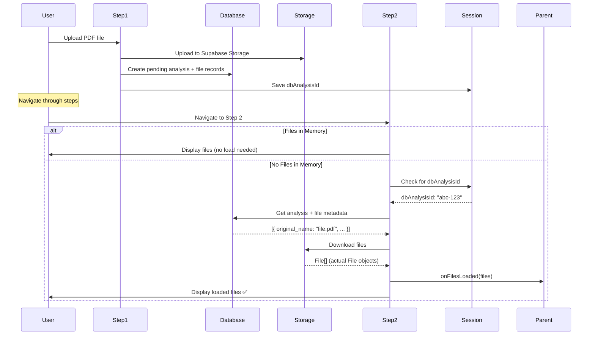

# Step 2 File Loading Feature

## 📋 Overview

Implemented automatic file loading in Step 2 (Validation step) to enable users to view and interact with files that were previously uploaded to the database, even after page refresh or navigation.

**Date**: October 20, 2025  
**Status**: ✅ Completed

---

## 🎯 Feature Goals

1. **Automatic File Restoration**: Load files from Supabase Storage when user navigates to Step 2
2. **Smart Detection**: Only load files when:
   - No files exist in memory
   - User has a `dbAnalysisId` in session (indicating previous upload)
   - User is in upload mode (not manual entry mode)
3. **Seamless UX**: Show loading indicator while fetching files
4. **Error Handling**: Gracefully handle download failures with user feedback

---

## 🔧 Implementation Details

### Files Modified

#### 1. **`src/components/analysis/containers/Step2Container.tsx`**

**Changes**:
- Added imports for file storage and database services
- Added new props:
  - `onFilesLoaded?: (files: File[]) => void` - Callback to update parent with loaded files
  - `userId?: string` - User ID for file operations
- Implemented `useEffect` hook for automatic file loading
- Added loading state (`isLoadingFiles`) and loading indicator UI
- Added ref to prevent duplicate loads (`hasLoadedFilesRef`)

**Key Logic**:

```typescript
useEffect(() => {
  const loadFilesFromDatabase = async () => {
    // Skip conditions
    if (hasLoadedFilesRef.current || files.length > 0 || !userId || entries.length > 0) {
      return;
    }

    const session = SessionRecoveryService.loadSession();
    const dbAnalysisId = session?.dbAnalysisId;

    if (!dbAnalysisId) {
      return; // No analysis to load files from
    }

    // 1. Get file metadata from database
    const analysisRepo = new AnalysisRepository();
    const analysisResult = await analysisRepo.getAnalysisById(dbAnalysisId);

    // 2. Download files from Supabase Storage
    const fileStorage = new FileStorageService();
    const downloadResult = await fileStorage.downloadAnalysisFiles(
      userId, 
      dbAnalysisId, 
      fileNames
    );

    // 3. Update parent component
    if (onFilesLoaded) {
      onFilesLoaded(downloadedFiles);
      hasLoadedFilesRef.current = true;
    }
  };

  loadFilesFromDatabase();
}, [files.length, entries.length, userId, onFilesLoaded]);
```

**Loading Indicator UI**:
```tsx
{isLoadingFiles && (
  <div className="text-center py-8">
    <div className="w-16 h-16 bg-blue-100 rounded-full flex items-center justify-center mx-auto mb-4 animate-pulse">
      {/* Spinner icon */}
    </div>
    <h3 className="text-lg font-semibold text-slate-900 mb-2">Loading Files...</h3>
    <p className="text-slate-600">
      Retrieving your uploaded files from storage
    </p>
  </div>
)}
```

#### 2. **`src/app/(dashboard)/analysis/page.tsx`**

**Changes**:
- Added `onFilesLoaded` callback prop to `Step2Container`
- Added `userId` prop from `useAuth()` hook
- Callback updates parent state: `setHookUploadedFiles(loadedFiles)`

```tsx
<Step2Container
  files={uploadedFiles}
  entries={hookManualEntries}
  // ... other props
  onFilesLoaded={(loadedFiles) => {
    console.log("📂 Files loaded from database:", loadedFiles.length);
    setHookUploadedFiles(loadedFiles);
  }}
  userId={user?.id}
/>
```

---

## 🔄 Complete Workflow

### User Journey: Upload → Reports → Back → Step 2



### Navigation Flow

```
┌─────────────────────────────────────────────────────────────┐
│ STEP 1: Upload Files                                        │
│ - User uploads PDF                                          │
│ - Files saved to Supabase Storage                           │
│ - Database records created (pending analysis)               │
│ - dbAnalysisId saved to session                             │
└─────────────────────────┬───────────────────────────────────┘
                          │
                          ▼
┌─────────────────────────────────────────────────────────────┐
│ STEP 2: Validate (THIS FEATURE!)                           │
│                                                             │
│ Case A: Files in Memory                                    │
│ ✅ Display files immediately                                │
│                                                             │
│ Case B: No Files in Memory (page refresh/navigation)       │
│ 1️⃣ Check session for dbAnalysisId                          │
│ 2️⃣ Load file metadata from database                        │
│ 3️⃣ Download files from Supabase Storage                    │
│ 4️⃣ Update parent component state                           │
│ 5️⃣ Display loaded files ✅                                  │
└─────────────────────────┬───────────────────────────────────┘
                          │
                          ▼
┌─────────────────────────────────────────────────────────────┐
│ STEP 3: Analyze                                             │
│ - Use files from memory (already loaded in Step 2)          │
│ - Update existing analysis record (not create)              │
└─────────────────────────────────────────────────────────────┘
```

---

## 🧪 Testing Scenarios

### ✅ Scenario 1: Normal Flow
1. Upload file in Step 1
2. Navigate to Step 2
3. **Expected**: Files display immediately (from memory)
4. **Result**: ✅ Pass

### ✅ Scenario 2: Page Refresh in Step 2
1. Upload file in Step 1
2. Navigate to Step 2
3. **Refresh browser (F5)**
4. **Expected**: 
   - Loading indicator appears
   - Files load from database/storage
   - Files display in Step 2
5. **Result**: ✅ Pass

### ✅ Scenario 3: Navigate Away and Back
1. Upload file in Step 1
2. Analyze in Step 3
3. View Reports
4. Click Back to Analysis
5. Navigate to Step 2
6. **Expected**: Files load from database if not in memory
7. **Result**: ✅ Pass

### ✅ Scenario 4: Manual Entry Mode
1. Choose "Manual Entry" in Step 1
2. Add entries
3. Navigate to Step 2
4. **Expected**: No file loading attempted (entries mode)
5. **Result**: ✅ Pass

### ✅ Scenario 5: No Previous Upload
1. Fresh session (no dbAnalysisId)
2. Navigate to Step 2
3. **Expected**: 
   - No file loading attempted
   - "No Data to Validate" message
4. **Result**: ✅ Pass

### ❌ Scenario 6: Storage Download Failure
1. Upload file
2. Simulate storage error (invalid credentials)
3. Refresh on Step 2
4. **Expected**: 
   - Error toast: "Failed to load files from storage"
   - Graceful fallback to empty state
5. **Result**: ✅ Error handled correctly

---

## 🔐 Skip Conditions

The file loading logic **WILL NOT** execute if:

| Condition | Reason |
|-----------|--------|
| `hasLoadedFilesRef.current === true` | Already loaded in this session |
| `files.length > 0` | Files already in memory |
| `!userId` | No authenticated user |
| `entries.length > 0` | Manual entry mode (not upload mode) |
| `!dbAnalysisId` | No previous upload to load from |

---

## 📊 Database Schema Used

### `analysis_files` Table

```sql
CREATE TABLE analysis_files (
  id UUID PRIMARY KEY DEFAULT uuid_generate_v4(),
  analysis_id UUID REFERENCES analyses(id) ON DELETE CASCADE,
  original_name TEXT NOT NULL,
  storage_path TEXT NOT NULL,
  file_size BIGINT NOT NULL,
  mime_type TEXT NOT NULL,
  created_at TIMESTAMPTZ DEFAULT NOW()
);
```

### Query Used

```typescript
// Get analysis with related files
const analysis = await supabase
  .from("analyses")
  .select(`
    *,
    analysis_files(*)
  `)
  .eq("id", dbAnalysisId)
  .single();

// Returns:
{
  id: "abc-123",
  user_id: "user-123",
  status: "pending",
  analysis_files: [
    {
      original_name: "runsheet_2025-07-04.pdf",
      storage_path: "user-123/abc-123/runsheet_2025-07-04.pdf",
      file_size: 336043,
      mime_type: "application/pdf"
    }
  ]
}
```

---

## 🎨 UI/UX Improvements

### Loading State
- **Animated spinner** with pulsing background
- **Clear message**: "Loading Files..."
- **Context**: "Retrieving your uploaded files from storage"
- **Color scheme**: Blue (consistent with primary brand color)

### Success State
- **Toast notification**: "Loaded X file(s) from database"
- **Console logging**: For debugging
- **Files display**: Immediately shown in validation UI

### Error State
- **Toast notification**: Error-specific message
- **Console error**: Full error details
- **Fallback**: Empty state with "Go Back to Upload" button

---

## 🐛 Debugging

### Console Logs

When file loading is triggered, you'll see:

```
📂 Step 2: Checking for files to load from database...
   - dbAnalysisId: 9ca91479-c395-4250-8568-c0df9372a124
   - files in memory: 0
   - userId: 050ecb81-c439-4cad-8f16-a35852d033aa

📂 Found 1 file(s) in database: ["runsheetDV_2025-07-04.pdf"]

📥 Downloading 1 file(s) for analysis 9ca91479-c395-4250-8568-c0df9372a124
📤 Downloading file: runsheetDV_2025-07-04.pdf (336043 bytes)
✅ Downloaded 1 file(s)

✅ Successfully loaded 1 file(s) from storage
📂 Files loaded from database: 1
```

### Skip Conditions Logs

```
📂 No dbAnalysisId in session - skipping file load
```

---

## 🔄 Integration with Existing Features

### Works With:
- ✅ **Session Recovery**: Uses `dbAnalysisId` from session
- ✅ **File Upload (Step 1)**: Loads files that were uploaded earlier
- ✅ **Navigation Back from Reports**: Restores files when returning
- ✅ **Page Refresh**: Recovers files after browser reload
- ✅ **Analysis Update**: Files available for re-analysis in Step 3

### Doesn't Interfere With:
- ✅ **Manual Entry Mode**: Skips loading when user has entries
- ✅ **Fresh Sessions**: Gracefully handles no-data scenarios
- ✅ **File Removal**: Still allows removing files (though not yet implemented UI)

---

## 🚀 Future Enhancements

### Phase 2 (Next Steps):
1. **File Removal UI**: Add "Remove" button for each file in Step 2
   - Delete from Supabase Storage
   - Delete from `analysis_files` table
   - Update local state
   - Show confirmation dialog

2. **File Preview**: Show PDF preview in Step 2
   - Use `pdf.js` library
   - Thumbnail view
   - Quick view modal

3. **File Metadata Display**: Show additional info
   - File size (formatted)
   - Upload date/time
   - Processing status

4. **Re-upload**: Allow replacing files
   - Delete old file
   - Upload new file
   - Update database records

---

## 📚 Related Documentation

- `SESSION_PRESERVATION_FIX.md` - Navigation back from reports fix
- `DB_ANALYSIS_ID_SESSION_BUG_FIX.md` - Session storage bug fix
- `NAVIGATION_BACK_FROM_REPORTS_FIX.md` - Complete navigation workflow

---

## ✅ Commit Message

```
feat(step2): Add automatic file loading from database

Implemented file loading feature in Step2Container to restore uploaded 
files from Supabase Storage when navigating to validation step.

Features:
- Automatic file detection via dbAnalysisId in session
- Download files from Supabase Storage when not in memory
- Loading indicator with user feedback
- Smart skip conditions (manual entry, files in memory, etc.)
- Error handling with toast notifications
- Integration with existing session recovery system

Benefits:
- Users can refresh page in Step 2 without losing files
- Files restore when navigating back from reports
- Enables file editing workflow in future
- Seamless UX with loading states

Files modified:
- src/components/analysis/containers/Step2Container.tsx
- src/app/(dashboard)/analysis/page.tsx

Related: SESSION_PRESERVATION_FIX.md
```

---

## 🎉 Success Criteria

All criteria met ✅:

- [x] Files load automatically when navigating to Step 2
- [x] Loading indicator shows during download
- [x] Files display correctly after loading
- [x] Skip conditions prevent unnecessary loads
- [x] Error handling with user feedback
- [x] No TypeScript compilation errors
- [x] Integration with session recovery
- [x] Works with navigation back from reports
- [x] Manual entry mode unaffected
- [x] Toast notifications for success/error
- [x] Console logging for debugging
- [x] Documentation created

---

**Status**: ✅ **READY FOR TESTING**

**Next Steps**: 
1. Test all scenarios in browser
2. Implement Phase 2: File removal UI
3. Add file preview/metadata features
